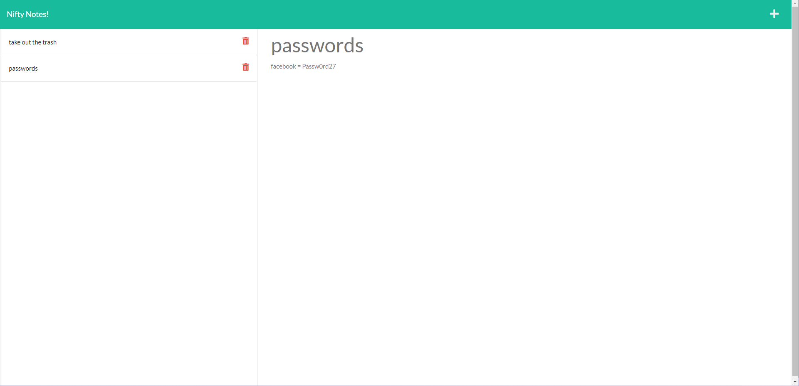

# nifty-notes!

  ## Description 
  
  Nifty Notes is an Express.js web application that allows users to create and save notes! To view a saved note, simply click on the note's title in the list of notes. Users may also delete their most recently saved note.
  
  ***

  

  ## Usage 
  
  Try [Nifty Notes](https://niftynotes.herokuapp.com/)!

  ## License

  Licensed under the MIT license. See [LICENSE.TXT](./LICENSE.TXT) for more information.

  ## Credits 

  